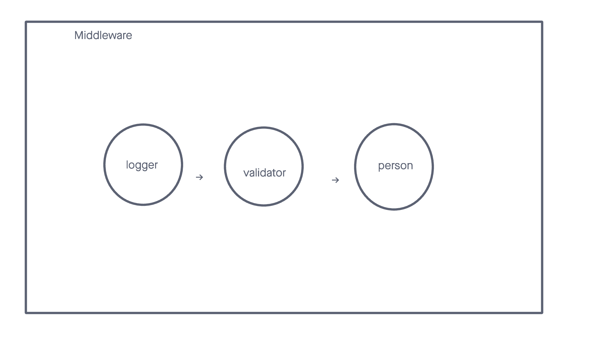

# LAB - Class 02

## Project: server-deployment-practice

### Author: Malik Sadiki-Torres

### Problem Domain

This very basic express server is used to test out middleware
### Links and Resources

- [GitHub Actions ci/cd](https://github.com/MalikTorres/basic-express-server)
- [back-end server](https://server-deployment-practice-piak.onrender.com)

### Collaborators

I based portions of my code on Ryan Gallaways demo.
I also worked with Josh Coffey on some of the validator aspects.

### Setup

#### `.env` requirements (where applicable)

port variable exists within the env sample

#### How to initialize/run your application (where applicable)

clone repo, `npm i`, then run `nodemon` in the terminal

#### Routes

- GET : `/person` - specific route to hit

#### Tests

to run tests, after running `npm i`, run the command `npm test`

#### UML

